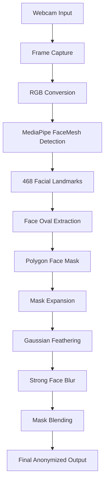
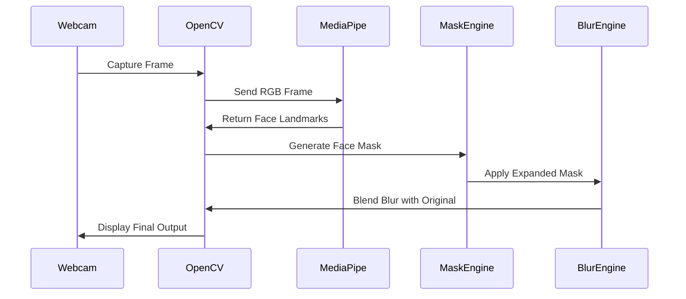
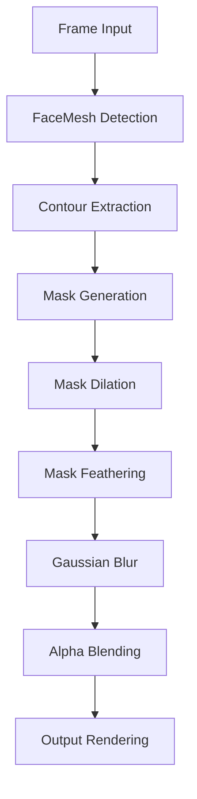

# AI Face Blur using OpenCV and MediaPipe

Real-time AI-powered face anonymization system using OpenCV and MediaPipe Face Mesh.
This project performs precise facial contour detection and applies smooth edge-aware blur masking for privacy protection and computer vision demonstrations.

---

# Overview

This project uses:

* OpenCV for image processing
* MediaPipe Face Mesh for facial landmark detection
* NumPy for mask manipulation

The application detects facial landmarks from a webcam stream, generates an accurate facial mask using facial contour landmarks, expands the mask region, smooths the edges using Gaussian feathering, and finally applies a realistic blur effect following exact facial boundaries.

The project also visualizes every major computer vision pipeline stage in separate live windows for demonstration and educational purposes.

---

# Features

* Real-time webcam face blur
* Accurate facial contour tracking
* MediaPipe 468 landmark detection
* Smooth feathered edge masking
* Expanded facial blur region
* Multiple visualization windows
* Real-time processing pipeline demonstration
* Privacy-focused face anonymization
* Edge-aware Gaussian blur

---

# Technologies Used

| Technology | Purpose                   |
| ---------- | ------------------------- |
| Python     | Core Programming Language |
| OpenCV     | Image Processing          |
| MediaPipe  | Facial Landmark Detection |
| NumPy      | Numerical Processing      |

---

# System Architecture



---

# Processing Pipeline


---

# Face Blur Workflow



---

# Visualization Windows

The application opens six real-time demonstration windows:

| Window                 | Description                    |
| ---------------------- | ------------------------------ |
| Original Webcam        | Raw webcam stream              |
| Face Landmarks         | 468 MediaPipe facial landmarks |
| Face Contour Detection | Detected facial boundary       |
| Face Mask              | Generated binary mask          |
| Smooth Expanded Mask   | Feathered and dilated mask     |
| Final Face Blur        | Final anonymized output        |

---

# Project Structure

```text
project/
│
├── main.py
├── requirements.txt
├── README.md
│
├── inputs/
│   └── _humanFace.jpg
│
└── outputs/
```

---

# Installation

## Clone Repository

```bash
git clone https://github.com/your-username/AI-Face-Blur.git
```

## Navigate to Project

```bash
cd AI-Face-Blur
```

## Create Virtual Environment

### Windows

```bash
python -m venv venv
venv\Scripts\activate
```

### Linux / Mac

```bash
python3 -m venv venv
source venv/bin/activate
```

---

# Install Dependencies

```bash
pip install -r requirements.txt
```

---

# Requirements

```txt
opencv-python==4.10.0.84
mediapipe==0.10.14
numpy==1.26.4
```

---

# Run Application

```bash
python main.py
```

Press `ESC` to close the webcam application.

---

# Core Computer Vision Concepts

## Facial Landmark Detection

MediaPipe Face Mesh detects:

* 468 facial landmarks
* jawline structure
* facial contour points
* facial geometry

---

## Mask Generation

The project creates:

1. Binary facial mask
2. Expanded blur region
3. Feathered edge mask
4. Smooth blending mask

---

## Blur Processing

Gaussian Blur is applied only on masked regions:

```python
blurred = cv2.GaussianBlur(frame, (151,151), 60)
```

---

# Mask Expansion Strategy

The blur region is expanded using morphological dilation:

```python
kernel = np.ones((75,75), np.uint8)
mask = cv2.dilate(mask, kernel, iterations=1)
```

This improves:

* anonymity coverage
* forehead blur
* jawline coverage
* edge consistency

---

# Performance Statistics

| Metric              | Value              |
| ------------------- | ------------------ |
| Landmark Points     | 468                |
| Webcam FPS          | Real-time          |
| Max Faces Supported | 1                  |
| Processing Type     | CPU-based          |
| Blur Method         | Gaussian Blur      |
| Detection Engine    | MediaPipe FaceMesh |

---

# Computational Pipeline



---

# Future Improvements

* Multi-face support
* GPU acceleration
* Face pixelation mode
* Background blur mode
* Eye tracking integration
* Face replacement system
* Live video recording
* Deep learning anonymization
* Dynamic blur strength
* YOLO integration

---

# Educational Value

This project demonstrates:

* Computer Vision
* Real-time Video Processing
* Facial Landmark Detection
* Image Segmentation
* Morphological Operations
* Gaussian Filtering
* Alpha Blending
* AI-based Privacy Systems

---

# Applications

* Privacy protection
* Video conferencing
* Surveillance anonymization
* Social media filters
* AI camera systems
* Security applications
* Research demonstrations
* Computer vision education

---

# Author

Sagar

Computer Vision and AI Enthusiast

---

# License

This project is open-source and available under the MIT License.
